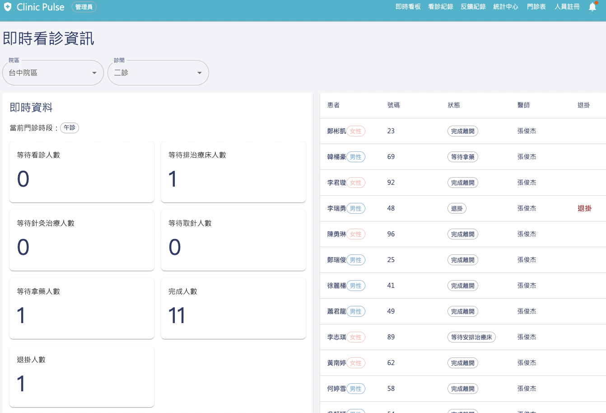

# Clinic-Pulse-api

[](http://standardjs.com)

<div align="center">
  
</div>

<br>
<br>
<p align="center">
  <a href="https://myclinics.life/">Start Using Clinic Pulse</a>
  <a href="#test-account">(test account)</a>
</p>

<br>

## About Clinic-Pulse

Clinic-Pulse is a clinic management system that integrates real-time outpatient information, historical data, statistics, and charts, enabling doctors and administrators to oversee every aspect of the medical workflow. This system not only enhances clinic operational efficiency but also leverages data analytics to optimize medical decision-making, ultimately improving the patient experience.

<br>

## Table of contents

- [Test Account](#test-account)
- [User Interface](#User-Interface)
- [Architecture Diagram](#architecture-diagram)
- [Features](#Features)
- [Local development](#local-development)

<br>

## Test Account

| Role   | Email                    | Password |
| ------ | ------------------------ | -------- |
| Admin  | admin@example.com        | 123456   |
| Doctor | doctor_zhang@example.com | 123456   |

<br>

## User Interface

### Admin selects a branch and consultation room to view real-time clinic status

<p align="center">
  
</p>

<br><br>

### Admin views the feedback list using filters and can click to see corresponding consultation details

<p align="center">
  
</p>

<br><br>

### Admin can view various statistical charts based on time granularity and multiple filters

<p align="center">
  
</p>

<br>

## Architecture Diagram

<p align="center">
  
</p>

Users enter a URL in the browser, which Route 53 resolves to an IP address. Traffic is managed by a Load Balancer. The frontend, built with React and MUI, is deployed on S3 and delivered via CloudFront CDN. A separate S3 bucket stores doctor profile photos.

The backend is containerized with Docker and runs on EC2 using Node.js and Express. Socket.IO provides real-time updates, and Bull manages asynchronous tasks. Data is stored in RDS (PostgreSQL), and Redis on another EC2 instance handles caching and queue management.

Gmail Service is used to send password reset emails.

<br>

## Features

### Admin

As admin, you can...

### 1. Register New Employees

- **Create accounts for newly hired staff and enter their detailed information.**

### 2. Real-Time Dashboard

- **View the current outpatient status of each clinic room across all branches.**

### 3. Outpatient List with Advanced Filters

- **Use various filters to view the outpatient list, including time range, branch, time slot, doctor's name, patient's name, minimum total duration, and maximum total duration.**
  - **View Outpatient Details**: Click on any outpatient entry to view detailed information.

### 4. Notifications for Abnormal Waiting Times

- **Receive automatic notifications for abnormal waiting times such as waiting for consultation, treatment bed arrangement, acupuncture treatment, needle removal, or medication pickup exceeding the set time.**

### 5. Feedback and Reviews Lists

- **Feedback List with Advanced Filters**: Use filters to view feedback, including time range, branch, time slot, feedback rating, doctor's name, and patient's name.
- **Google Reviews List with Advanced Filters**: Filters include time range, branch, review rating, and patient's name.
  - Click on any feedback or review to view detailed information.

### 6. Statistics Center

- **Access three statistical categories—Outpatient, Feedback, and Google Reviews.**
  - **Outpatient Statistics**: View charts including patient numbers, first-time visit rates, appointment rates, cancellation rates, and average waiting times.
  - **Feedback Statistics**: Charts based on feedback ratings and categories.
  - **Google Reviews Statistics**: Charts based on review ratings and ratios.

### 7. Outpatient Schedules

- **View the outpatient schedules for each branch.**

### 8. Low-Rating Notifications

- **Receive automatic notifications for feedback or reviews with ratings lower than five stars.**

### 9. Manage Notifications

- **Click on the bell icon to view the notification list.** Mark notifications as read, delete individually or all at once, and view related outpatient, feedback, or review details.

### Doctor

As doctor, you can...

### 1. Profile Management

- **Edit your avatar and change your default password.**

### 2. Real-time Dashboard

- **View the current status of your clinic sessions.**

### 3. Consultation List

- **Use diverse filters to view your consultation list, including time intervals, session times, patient names, minimum and maximum total duration.**
  - Clicking on any consultation in the list will show detailed information about that consultation.
  - You will receive automatic real-time notifications for any abnormal wait times such as waiting for consultation, arranging a treatment bed, acupuncture treatment, needle removal, and medication pickup that exceed set times.

### 4. Feedback List

- **Use diverse filters to view your feedback list, including time intervals, session times, feedback ratings, and patient names.**
  - Clicking on any feedback will show detailed information about that feedback.

### 5. Statistics Center

- **In the Statistics Center, there are two types of statistics: consultations and feedback.**
  - **Consultation Statistics Center:** View statistical charts related to your consultations based on time granularity, including total and average patient numbers, number of first-time consultations and their rate, online appointment numbers and their rate, cancellation numbers and their rate, average waiting time, and numbers and rates of acupuncture and medication treatments.
  - **Feedback Statistics Center:** View statistical charts related to your feedback based on time granularity, including feedback star ratings and categories.

### 6. Clinic Schedule

- **View your clinic schedule.**

### 7. Notifications

- **Click on the bell icon to view the notification list.**
  - You can read and delete notifications individually or all at once.
  - Clicking on any notification will show details related to that specific consultation.

<br>

## Local development

### Setup

The following tools need to be installed on your system in advance:

- `git`: `>=2`
- `nodejs`: `>=16 <17`
- `npm`: `>=8 <9`
- `docker`: `>=18.09`
- `docker-compose`: `>=1.28.6` (service profiles is not supported until version `1.28.0`)

### Install dependency

First clone the repository, then run the following commands to install the dependencies:

```shell
npm clean-install
```

**please do not use the command npm install as it might upgrade dependencies unintentionally**

### Setup database

1. Setup environment variables by coping `.env-sample` file to `.env` and fill it proper values
2. Run the PostgreSQL using docker-compose:

```shell
docker-compose --profile dev up -d [--build]
```

If you encounter problems with docker-compose, you may run:

```
$ docker-compose down [--rmi local] [--remove-orphans] [-v]
```

- `docker-compose down` will stop & remove the containers
- `--rmi local` will remove local images
- `--remove-orphans` will remove unneeded orphan containers
- `-v` will remove volumes (**WARNING: THIS WILL WIPE ALL YOUR OLD LOCAL DATABASE DATA**)

### Running the application

```shell
npm run dev
```

### Lint and formatting

We recommend that you use [Visual Studio Code](https://code.visualstudio.com/) to work on the project. We use [ESLint](https://github.com/eslint/eslint) & [Prettier](https://github.com/prettier/prettier) to keep our code consistent in terms of style and reducing defects. We recommend installing the the [ESLint Extension](https://marketplace.visualstudio.com/items?itemName=dbaeumer.vscode-eslint) & [Prettier Extension](https://marketplace.visualstudio.com/items?itemName=esbenp.prettier-vscode) as well.

Reference: [Setting up ESlint with Standard and Prettier](https://medium.com/nerd-for-tech/setting-up-eslint-with-standard-and-prettier-be245cb9fc64)

### Other Extension

- [pretty-ts-errors](https://marketplace.visualstudio.com/items?itemName=yoavbls.pretty-ts-errors): make TS error message readable

### Local API testing

We use [REST Client](https://marketplace.visualstudio.com/items?itemName=humao.rest-client) extension to test the API locally. You can find the API test scripts in `docs/scripts` folder.

### Migrations

Generate new migration file from an entity:

Automatic migration generation creates a new migration file and writes all sql queries that must be executed to update the database.
If no there were no changes generated, the command will exit with code 1.

```
$ npm run typeorm migration:generate ./migrations/{MigrationName}
```

Run migrations:

```
$ npm run typeorm migration:run
```

Reverts last executed migration:

```
$ npm run typeorm migration:revert
```
